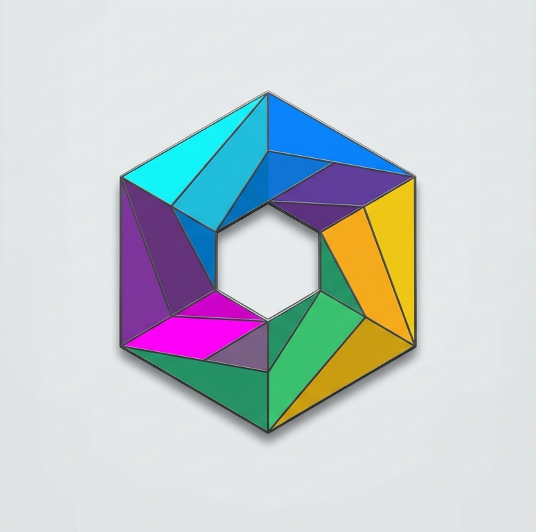
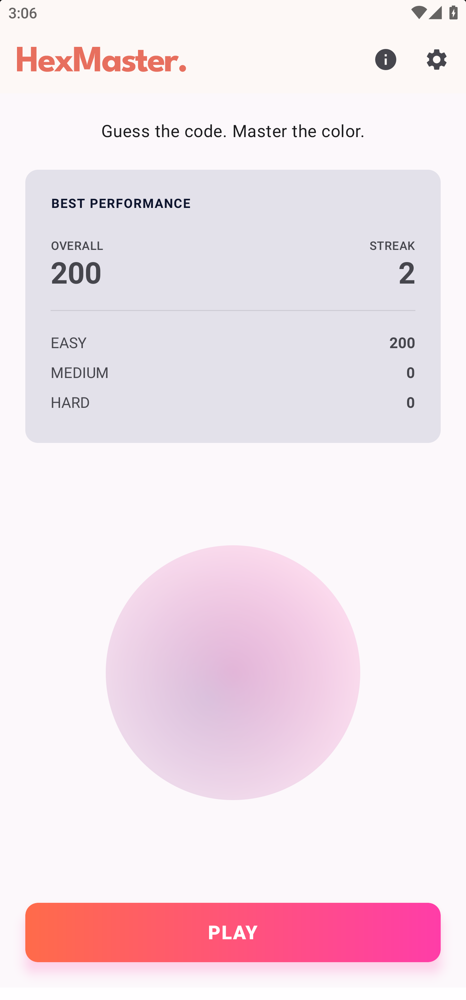
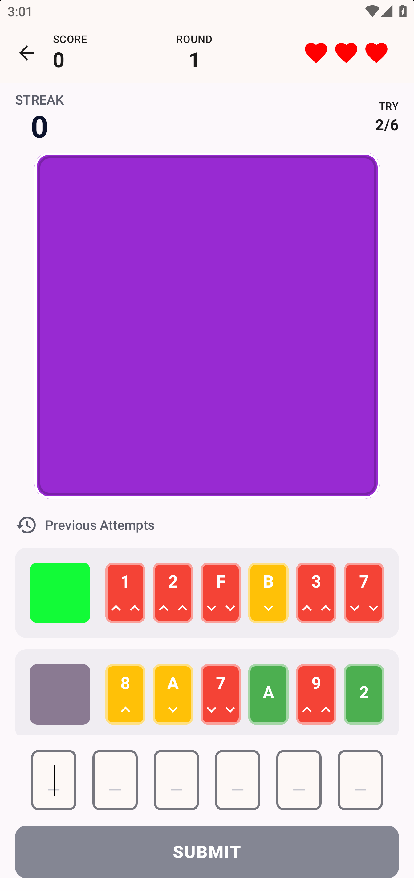
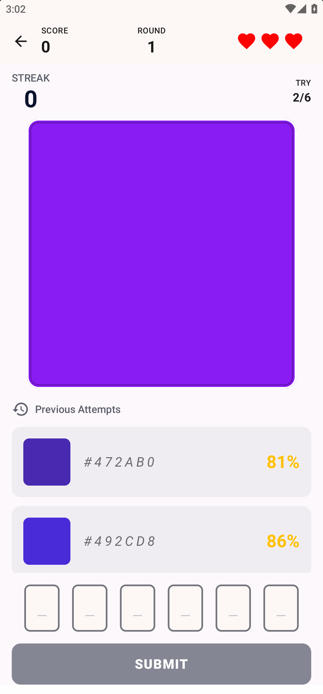
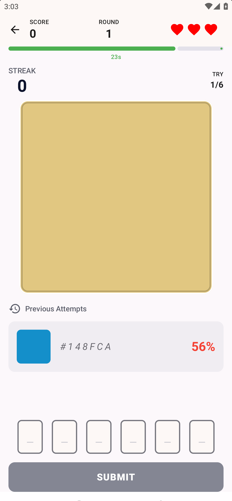
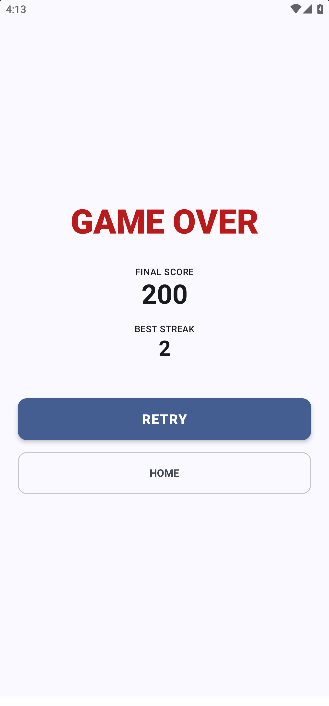

<p align="center">
  
</p>

<h1 align="center">HexMaster</h1>

<p align="center">
  An arcade-style color-guessing game for Android — see a color, guess its hex code.
</p>

---

## Overview

A random color is shown on screen. You type your best guess at its 6-digit
hex code. How much feedback you get — and how much pressure you're under —
depends on the difficulty:

| Difficulty | Feedback                                                             | Timer                     |
|------------|----------------------------------------------------------------------|---------------------------|
| **Easy**   | Per-digit color + directional arrows showing how close each digit is | None                      |
| **Medium** | Overall similarity percentage                                        | None                      |
| **Hard**   | Same as Medium                                                       | Fixed per-round countdown |

The game is endless with 3 lives — miss too many rounds and it's game over.
Score is based on accuracy (and speed, in Hard mode), with both an overall
high score and a per-difficulty breakdown saved locally.

## App Icon

<p align="center">
  
</p>


## Screenshots

|               |                                                          |
|---------------|----------------------------------------------------------|
| Home          |       |
| Game (Easy)   |       |
| Game (medium) |     |
| Game (Hard)   |       |
| Game Over     |  |

## Features

- Three difficulty modes with distinct feedback systems
- Per-digit hex grading with color + arrow indicators (colorblind-safe —
  never relies on color alone)
- Timed Hard mode with a speed-based scoring bonus
- Endless play with a 3-life system and streak tracking
- Local high scores — overall best plus a per-difficulty breakdown
- Sound & vibration toggles

## Tech Stack

- **Language:** Kotlin
- **UI:** Jetpack Compose + Material 3 (default M3 theme/typography/color scheme
  to start — no custom pixel font or bespoke palette for v1; swap in `ui/theme/`
  later if desired)
- **Architecture:** MVVM (`ViewModel` + `StateFlow` + unidirectional UI state)
- **Navigation:** Compose Navigation (single-Activity app)
- **DI:** Manual DI via a lightweight `ServiceLocator` / `AppContainer` object
  (Hilt is overkill for this app's size — easy to add later if it grows)
- **Persistence:** Jetpack DataStore (Preferences) — see §3.6 for exact keys
- **Testing:** JUnit + Turbine (Flow testing) for ViewModels; pure unit tests for
  game-logic classes (no Android dependency needed there)
- **Build config:** Gradle Kotlin DSL + a version catalog (`libs.versions.toml`)
- **minSdk:** 24 (Android 7.0) · **targetSdk/compileSdk:** latest stable at
  build time (confirm actual number against `libs.versions.toml` once created
  — don't hardcode a remembered number)


## Project Structure

```
app/
 └─ src/
     ├─ main/
     │   ├─ java/com/abra/hexmaster/
     │   │   ├─ HexMasterApplication.kt
     │   │   ├─ MainActivity.kt
     │   │   │
     │   │   ├─ di/
     │   │   │   └─ AppContainer.kt              // manual DI holder
     │   │   │
     │   │   ├─ core/
     │   │   │   ├─ color/
     │   │   │   │   ├─ ColorGenerator.kt
     │   │   │   │   └─ HexColorUtils.kt
     │   │   │   ├─ scoring/
     │   │   │   │   ├─ GuessEvaluator.kt
     │   │   │   │   └─ ScoreCalculator.kt
     │   │   │   └─ GameBalanceConfig.kt          // thresholds, timer length, base points
     │   │   │
     │   │   ├─ data/
     │   │   │   ├─ model/
     │   │   │   │   ├─ Difficulty.kt             // enum: EASY, MEDIUM, HARD
     │   │   │   │   ├─ DigitFeedback.kt           // color + arrow per digit
     │   │   │   │   ├─ RoundResult.kt
     │   │   │   │   └─ GameUiState.kt
     │   │   │   └─ preferences/
     │   │   │       └─ SettingsDataStore.kt       // high scores, best streak, settings
     │   │   │
     │   │   ├─ domain/
     │   │   │   └─ GameEngine.kt                  // round loop, lives, streak, score
     │   │   │
     │   │   └─ ui/
     │   │       ├─ navigation/
     │   │       │   ├─ HexMasterNavGraph.kt
     │   │       │   └─ Screen.kt                  // sealed class of routes
     │   │       │
     │   │       ├─ theme/
     │   │       │   ├─ Color.kt                   // neon arcade palette
     │   │       │   ├─ Type.kt                    // retro/pixel display font
     │   │       │   ├─ Shape.kt
     │   │       │   └─ Theme.kt
     │   │       │
     │   │       ├─ components/
     │   │       │   ├─ ColorSwatch.kt
     │   │       │   ├─ HexOtpInputField.kt        // 6-box OTP-style hex entry, auto-advance
     │   │       │   ├─ DigitFeedbackRow.kt        // Easy mode: 6 colored digits + arrows (always shown, not color-only)
     │   │       │   ├─ ArrowIndicator.kt
     │   │       │   ├─ SimilarityMeter.kt         // Medium/Hard mode: % gauge
     │   │       │   ├─ LivesDisplay.kt
     │   │       │   ├─ StreakDisplay.kt
     │   │       │   ├─ RoundTimerBar.kt           // Hard mode countdown
     │   │       │   └─ ArcadeButton.kt
     │   │       │
     │   │       └─ screens/
     │   │           ├─ home/
     │   │           │   ├─ HomeScreen.kt
     │   │           │   └─ HomeViewModel.kt
     │   │           ├─ difficultyselect/
     │   │           │   └─ DifficultySelectScreen.kt
     │   │           ├─ game/
     │   │           │   ├─ GameScreen.kt
     │   │           │   └─ GameViewModel.kt
     │   │           ├─ gameover/
     │   │           │   └─ GameOverScreen.kt
     │   │           └─ settings/
     │   │               ├─ SettingsScreen.kt
     │   │               └─ SettingsViewModel.kt
     │   │
     │   ├─ res/
     │   │   ├─ raw/                                // sfx: user-supplied files go here
     │   │   │                                       // (correct.*, wrong.*, tick.* — see AGENTS.md)
     │   │   ├─ mipmap*/                             // app icon: user-supplied
     │   │   └─ values/ (strings, colors fallback)
     │   │
     │   └─ AndroidManifest.xml
     │
     ├─ test/java/com/abra/hexmaster/
     │   ├─ core/
     │   │   ├─ ColorGeneratorTest.kt
     │   │   ├─ HexColorUtilsTest.kt
     │   │   ├─ GuessEvaluatorTest.kt
     │   │   └─ ScoreCalculatorTest.kt
     │   └─ domain/
     │       └─ GameEngineTest.kt
     │
     └─ androidTest/java/com/abra/hexmaster/
         └─ ui/                                    // optional Compose UI tests
```

Root-level:
```
HexMaster/
 ├─ app/                     (above)
 ├─ gradle/libs.versions.toml
 ├─ build.gradle.kts
 ├─ settings.gradle.kts
 ├─ AGENTS.md                (see companion file)
 └─ README.md
```

See [`HexMaster_Architecture_Plan.md`](HexMaster_Architecture_Plan.md) for the
full tree and rationale.

## Getting Started

1. Clone the repo and open it in Android Studio (Iguana or newer recommended).
2. Let Gradle sync — dependency versions are pinned in
   `gradle/libs.versions.toml`.
3. Run on an emulator or device with **API 24+**.

```bash
./gradlew assembleDebug     # build a debug APK
./gradlew test              # run unit tests (core game-logic + ViewModels)
```

## Contributing / Working on this project

If you're an AI coding agent (or a human) picking this project up,
**read [`AGENTS.md`](AGENTS.md) first** — it documents the binding
architectural rules, input-handling behavior, accessibility requirements, and
persistence keys that any change should respect.

## License

## License

```
MIT License

Copyright (c) 2025 Abra

Permission is hereby granted, free of charge, to any person obtaining a copy
of this software and associated documentation files (the "Software"), to deal
in the Software without restriction, including without limitation the rights
to use, copy, modify, merge, publish, distribute, sublicense, and/or sell
copies of the Software, and to permit persons to whom the Software is
furnished to do so, subject to the following conditions:

The above copyright notice and this permission notice shall be included in all
copies or substantial portions of the Software.

THE SOFTWARE IS PROVIDED "AS IS", WITHOUT WARRANTY OF ANY KIND, EXPRESS OR
IMPLIED, INCLUDING BUT NOT LIMITED TO THE WARRANTIES OF MERCHANTABILITY,
FITNESS FOR A PARTICULAR PURPOSE AND NONINFRINGEMENT.
```

---

<div align="center">
  <sub>Built with Kotlin and Jetpack Compose · No internet required · No tracking</sub>
</div>
